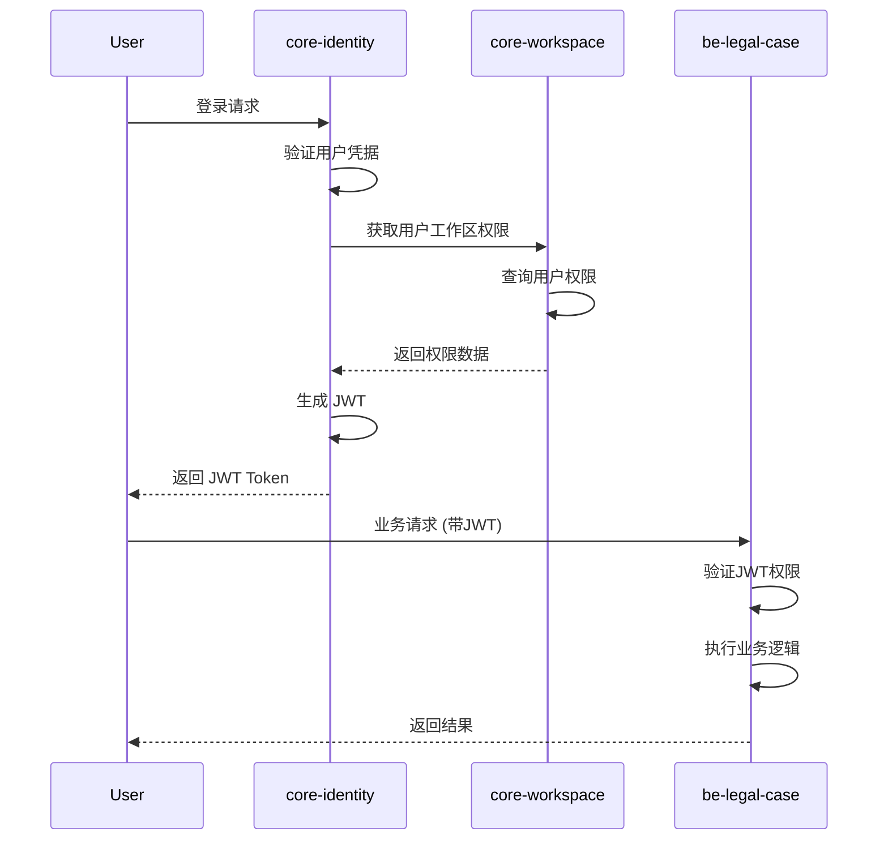

# 多租户系统 RBAC 架构设计

## 系统现状分析

### 服务架构
- **core-identity**: OAuth2 认证服务 + 用户管理
- **core-workspace**: 租户(Workspace)管理服务  
- **be-legal-case**: 业务系统（法律案件管理）

### 当前架构评估

#### ✅ 优势
- **服务职责清晰**: 认证、租户、业务分离
- **多租户基础**: Workspace 已实现租户隔离
- **OAuth2 集成**: 统一认证，JWT 令牌传递

#### ❌ 不足
- **角色分散**: 用户全局角色在 identity，工作区角色在 workspace
- **权限缺失**: 缺少细粒度权限管理
- **跨服务协调复杂**: 权限验证需要多服务交互

## 推荐的多租户 RBAC 架构

### 1. 服务职责划分

```yaml
core-identity:
  职责: 
    - 用户认证 (OAuth2/OIDC)
    - 全局用户管理
    - JWT 令牌签发
  数据:
    - UserInfo (用户基础信息)
    - 全局系统角色 (SYSTEM_ADMIN)

core-workspace:  
  职责:
    - 租户(Workspace)管理
    - 租户级别 RBAC
    - 权限模板管理
  数据:
    - Workspace (租户)
    - WorkspaceRole (租户角色)
    - WorkspacePermission (租户权限)
    - RolePermissionMapping

be-legal-case:
  职责:
    - 业务逻辑
    - 资源级别权限控制
  数据:
    - 业务数据 (Case, Document)
    - 资源权限策略
```

### 2. 数据模型设计

#### core-workspace 权限模型

```java
// 权限定义
@Entity
@Table(name = "permissions")
public class Permission {
    @Id
    private String id;
    
    @Column(unique = true, nullable = false)
    private String code;           // "case:create", "document:delete"
    
    private String service;        // "legal-case", "project"
    private String resource;       // "case", "document"
    private String action;         // "create", "read", "update", "delete"
    private String description;
}

// 角色模板 (跨租户复用)
@Entity
@Table(name = "role_templates")
public class RoleTemplate {
    @Id
    private String id;
    
    private String name;           // "Senior Lawyer", "Paralegal"
    private String category;       // "LEGAL", "GENERAL"
    
    @ManyToMany
    private Set<Permission> defaultPermissions;
}

// 租户自定义角色
@Entity
@Table(name = "workspace_roles")
public class WorkspaceRole {
    @Id
    private String id;
    
    @ManyToOne
    private Workspace workspace;
    
    private String name;
    
    @ManyToOne
    private RoleTemplate template; // 可选，基于模板创建
    
    @ManyToMany
    private Set<Permission> permissions;
    
    private boolean isCustom;
}

// 用户在租户中的成员关系
@Entity
@Table(name = "workspace_members")
public class WorkspaceMember {
    @Id
    private String id;
    
    private String userId;
    
    @ManyToOne
    private Workspace workspace;
    
    @ManyToMany
    private Set<WorkspaceRole> roles;  // 支持多角色
    
    @ManyToMany
    private Set<Permission> additionalPermissions; // 额外权限
}
```

### 3. JWT Token 结构

```json
{
  "sub": "user-id",
  "email": "user@example.com",
  "global_roles": ["SYSTEM_USER"],
  "workspaces": {
    "workspace-id-1": {
      "name": "Law Firm A",
      "roles": ["SENIOR_LAWYER", "CASE_MANAGER"],
      "permissions": ["case:*", "document:read", "client:manage"]
    },
    "workspace-id-2": {
      "name": "Law Firm B", 
      "roles": ["CONSULTANT"],
      "permissions": ["case:read", "document:read"]
    }
  },
  "active_workspace": "workspace-id-1",
  "iat": 1234567890,
  "exp": 1234571490
}
```

### 4. 服务交互流程



### 5. 核心实现

#### A. 权限服务 (core-workspace)

```java
@Service
@Transactional
public class WorkspacePermissionService {
    
    @Autowired
    private WorkspaceMemberRepository memberRepository;
    
    @Autowired
    private PermissionCacheService cacheService;
    
    /**
     * 获取用户在指定工作区的权限
     */
    public UserWorkspacePermissions getUserPermissions(String userId, String workspaceId) {
        // 优先从缓存获取
        UserWorkspacePermissions cached = cacheService.getPermissions(userId, workspaceId);
        if (cached != null) {
            return cached;
        }
        
        // 查询数据库
        WorkspaceMember member = memberRepository
            .findByUserIdAndWorkspaceId(userId, workspaceId)
            .orElseThrow(() -> new NotFoundException("Member not found"));
        
        // 收集权限
        Set<String> permissions = new HashSet<>();
        
        // 从角色收集权限
        member.getRoles().forEach(role -> 
            permissions.addAll(role.getPermissions().stream()
                .map(Permission::getCode)
                .collect(Collectors.toSet())));
        
        // 添加额外权限
        permissions.addAll(member.getAdditionalPermissions().stream()
            .map(Permission::getCode)
            .collect(Collectors.toSet()));
        
        UserWorkspacePermissions result = UserWorkspacePermissions.builder()
            .userId(userId)
            .workspaceId(workspaceId)
            .workspaceName(member.getWorkspace().getName())
            .roles(member.getRoles().stream()
                .map(WorkspaceRole::getName)
                .collect(Collectors.toSet()))
            .permissions(permissions)
            .build();
        
        // 缓存结果
        cacheService.cachePermissions(result);
        
        return result;
    }
    
    /**
     * 批量获取用户的所有工作区权限
     */
    public Map<String, UserWorkspacePermissions> getUserAllWorkspacePermissions(String userId) {
        List<WorkspaceMember> memberships = memberRepository.findByUserId(userId);
        
        return memberships.stream()
            .collect(Collectors.toMap(
                member -> member.getWorkspace().getId(),
                member -> getUserPermissions(userId, member.getWorkspace().getId())
            ));
    }
}
```

#### B. JWT 增强 (core-identity)

```java
@Component
public class EnhancedJwtTokenCustomizer implements OAuth2TokenCustomizer<JwtEncodingContext> {
    
    @Autowired
    private WorkspacePermissionClient workspaceClient;
    
    @Override
    public void customize(JwtEncodingContext context) {
        Authentication principal = context.getPrincipal();
        UserInfo user = (UserInfo) principal.getPrincipal();
        
        // 获取用户的所有工作区权限
        Map<String, UserWorkspacePermissions> workspacePermissions = 
            workspaceClient.getUserAllWorkspacePermissions(user.getId());
        
        // 构建工作区权限信息
        Map<String, Map<String, Object>> workspaces = new HashMap<>();
        workspacePermissions.forEach((workspaceId, permissions) -> {
            Map<String, Object> workspaceData = new HashMap<>();
            workspaceData.put("name", permissions.getWorkspaceName());
            workspaceData.put("roles", permissions.getRoles());
            workspaceData.put("permissions", permissions.getPermissions());
            workspaces.put(workspaceId, workspaceData);
        });
        
        // 添加到 JWT Claims
        context.getClaims()
            .claim("email", user.getEmail())
            .claim("global_roles", user.getRoles())
            .claim("workspaces", workspaces)
            .claim("active_workspace", determineActiveWorkspace(workspacePermissions));
    }
}
```

#### C. 权限验证 (be-legal-case)

```java
@Component
public class WorkspaceSecurityService {
    
    @Value("${app.workspace.header:X-Workspace-Id}")
    private String workspaceHeader;
    
    /**
     * 检查当前用户是否有指定权限
     */
    public boolean hasPermission(String permission) {
        Authentication auth = SecurityContextHolder.getContext().getAuthentication();
        String workspaceId = getCurrentWorkspaceId();
        
        // 从JWT获取工作区权限
        Jwt jwt = (Jwt) auth.getPrincipal();
        Map<String, Object> workspaces = jwt.getClaim("workspaces");
        
        if (workspaces == null || !workspaces.containsKey(workspaceId)) {
            return false;
        }
        
        Map<String, Object> workspace = (Map<String, Object>) workspaces.get(workspaceId);
        List<String> permissions = (List<String>) workspace.get("permissions");
        
        return permissions.stream().anyMatch(p -> matchPermission(p, permission));
    }
    
    /**
     * 权限匹配，支持通配符
     */
    private boolean matchPermission(String granted, String required) {
        // 完全匹配
        if (granted.equals(required)) {
            return true;
        }
        
        // 通配符匹配: case:* 匹配 case:read, case:write
        if (granted.endsWith("*")) {
            String prefix = granted.substring(0, granted.length() - 1);
            return required.startsWith(prefix);
        }
        
        return false;
    }
    
    /**
     * 获取当前工作区ID
     */
    private String getCurrentWorkspaceId() {
        HttpServletRequest request = 
            ((ServletRequestAttributes) RequestContextHolder.currentRequestAttributes())
            .getRequest();
        
        String workspaceId = request.getHeader(workspaceHeader);
        if (workspaceId == null) {
            throw new IllegalStateException("No workspace context");
        }
        
        return workspaceId;
    }
}

// 使用示例
@Service
public class CaseService {
    
    @Autowired
    private WorkspaceSecurityService securityService;
    
    @PreAuthorize("@workspaceSecurityService.hasPermission('case:create')")
    public LegalCase createCase(CreateCaseRequest request) {
        // 业务逻辑
    }
    
    @PreAuthorize("@workspaceSecurityService.hasPermission('case:read')")
    public LegalCase getCase(String caseId) {
        // 业务逻辑
    }
    
    @PreAuthorize("@workspaceSecurityService.hasPermission('case:update') " +
                  "and @caseOwnershipService.canAccess(#caseId)")
    public LegalCase updateCase(String caseId, UpdateCaseRequest request) {
        // 业务逻辑
    }
}
```

#### D. 缓存策略

```java
@Service
public class PermissionCacheService {
    
    @Autowired
    private RedisTemplate<String, Object> redisTemplate;
    
    private static final String PERMISSION_KEY = "permissions:user:%s:workspace:%s";
    private static final long CACHE_TTL = 300; // 5分钟
    
    public UserWorkspacePermissions getPermissions(String userId, String workspaceId) {
        String key = String.format(PERMISSION_KEY, userId, workspaceId);
        return (UserWorkspacePermissions) redisTemplate.opsForValue().get(key);
    }
    
    public void cachePermissions(UserWorkspacePermissions permissions) {
        String key = String.format(PERMISSION_KEY, 
            permissions.getUserId(), 
            permissions.getWorkspaceId());
        redisTemplate.opsForValue().set(key, permissions, CACHE_TTL, TimeUnit.SECONDS);
    }
    
    @CacheEvict(value = "userPermissions", key = "#userId + ':' + #workspaceId")
    public void invalidateCache(String userId, String workspaceId) {
        String key = String.format(PERMISSION_KEY, userId, workspaceId);
        redisTemplate.delete(key);
    }
    
    /**
     * 权限变更时清除相关缓存
     */
    @EventListener
    public void handlePermissionChange(PermissionChangeEvent event) {
        invalidateCache(event.getUserId(), event.getWorkspaceId());
    }
}
```

### 6. 权限管理 API

```java
@RestController
@RequestMapping("/api/workspace/{workspaceId}/rbac")
@Tag(name = "Workspace RBAC", description = "工作区权限管理")
public class WorkspaceRbacController {
    
    @Autowired
    private WorkspaceRbacService rbacService;
    
    @PostMapping("/roles")
    @PreAuthorize("@workspaceSecurity.hasRole(#workspaceId, 'ADMIN')")
    @Operation(summary = "创建角色")
    public WorkspaceRole createRole(
            @PathVariable String workspaceId,
            @RequestBody @Valid CreateRoleRequest request) {
        return rbacService.createWorkspaceRole(workspaceId, request);
    }
    
    @PutMapping("/roles/{roleId}")
    @PreAuthorize("@workspaceSecurity.hasRole(#workspaceId, 'ADMIN')")
    @Operation(summary = "更新角色")
    public WorkspaceRole updateRole(
            @PathVariable String workspaceId,
            @PathVariable String roleId,
            @RequestBody @Valid UpdateRoleRequest request) {
        return rbacService.updateWorkspaceRole(workspaceId, roleId, request);
    }
    
    @DeleteMapping("/roles/{roleId}")
    @PreAuthorize("@workspaceSecurity.hasRole(#workspaceId, 'OWNER')")
    @Operation(summary = "删除角色")
    public void deleteRole(
            @PathVariable String workspaceId,
            @PathVariable String roleId) {
        rbacService.deleteWorkspaceRole(workspaceId, roleId);
    }
    
    @PutMapping("/members/{memberId}/roles")
    @PreAuthorize("@workspaceSecurity.hasRole(#workspaceId, 'ADMIN')")
    @Operation(summary = "分配角色给成员")
    public void assignRoles(
            @PathVariable String workspaceId,
            @PathVariable String memberId,
            @RequestBody Set<String> roleIds) {
        rbacService.assignRolesToMember(workspaceId, memberId, roleIds);
    }
    
    @PutMapping("/members/{memberId}/permissions")
    @PreAuthorize("@workspaceSecurity.hasRole(#workspaceId, 'ADMIN')")
    @Operation(summary = "分配额外权限给成员")
    public void assignPermissions(
            @PathVariable String workspaceId,
            @PathVariable String memberId,
            @RequestBody Set<String> permissionCodes) {
        rbacService.assignPermissionsToMember(workspaceId, memberId, permissionCodes);
    }
    
    @GetMapping("/permissions")
    @Operation(summary = "获取所有可用权限")
    public List<Permission> getAvailablePermissions(
            @PathVariable String workspaceId,
            @RequestParam(required = false) String service) {
        return rbacService.getAvailablePermissions(service);
    }
    
    @GetMapping("/role-templates")
    @Operation(summary = "获取角色模板")
    public List<RoleTemplate> getRoleTemplates(
            @RequestParam(required = false) String category) {
        return rbacService.getRoleTemplates(category);
    }
}
```

## 实施计划

### Phase 1: 基础设施 (2周)
- [ ] 在 core-workspace 创建权限数据模型
- [ ] 实现权限管理基础 API
- [ ] 设置 Redis 缓存层

### Phase 2: 集成认证 (1周)
- [ ] 更新 core-identity JWT 生成逻辑
- [ ] 实现工作区权限查询客户端
- [ ] 测试 JWT 权限信息传递

### Phase 3: 业务系统集成 (2周)
- [ ] be-legal-case 集成权限验证组件
- [ ] 改造现有 API 添加权限控制
- [ ] 实现资源级别权限检查

### Phase 4: 迁移与优化 (1周)
- [ ] 数据迁移脚本
- [ ] 性能测试与优化
- [ ] 文档更新

## 关键决策点

1. **权限粒度**: 采用 `resource:action` 格式，支持通配符
2. **缓存策略**: 5分钟 TTL，权限变更时主动失效
3. **向后兼容**: 保留现有角色枚举，逐步迁移
4. **性能考虑**: JWT 只包含活跃工作区权限，其他按需加载

## 风险与缓解

| 风险 | 影响 | 缓解措施 |
|-----|------|---------|
| JWT 过大 | 网络传输性能 | 只包含必要权限，详细权限按需查询 |
| 缓存一致性 | 权限更新延迟 | 实现主动失效机制 |
| 服务间依赖 | 系统可用性 | 实现降级策略，本地权限缓存 |
| 迁移复杂度 | 业务中断 | 分阶段迁移，保持向后兼容 |

## 总结

该架构方案实现了：
- ✅ **清晰的服务边界**: 认证、租户、业务职责分离
- ✅ **灵活的权限管理**: 支持角色、权限、资源级控制
- ✅ **多租户隔离**: 完整的租户级 RBAC
- ✅ **高性能**: 缓存优化，减少查询开销
- ✅ **可扩展性**: 支持新服务接入，权限模板